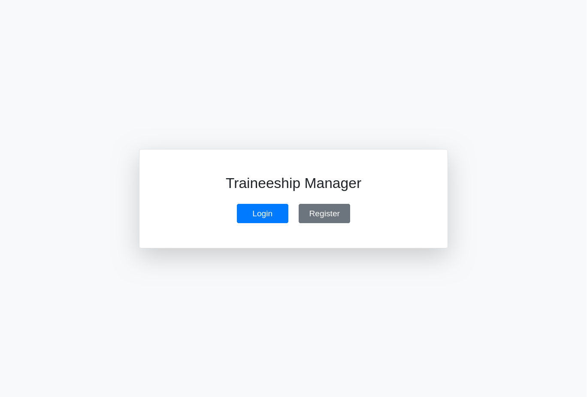
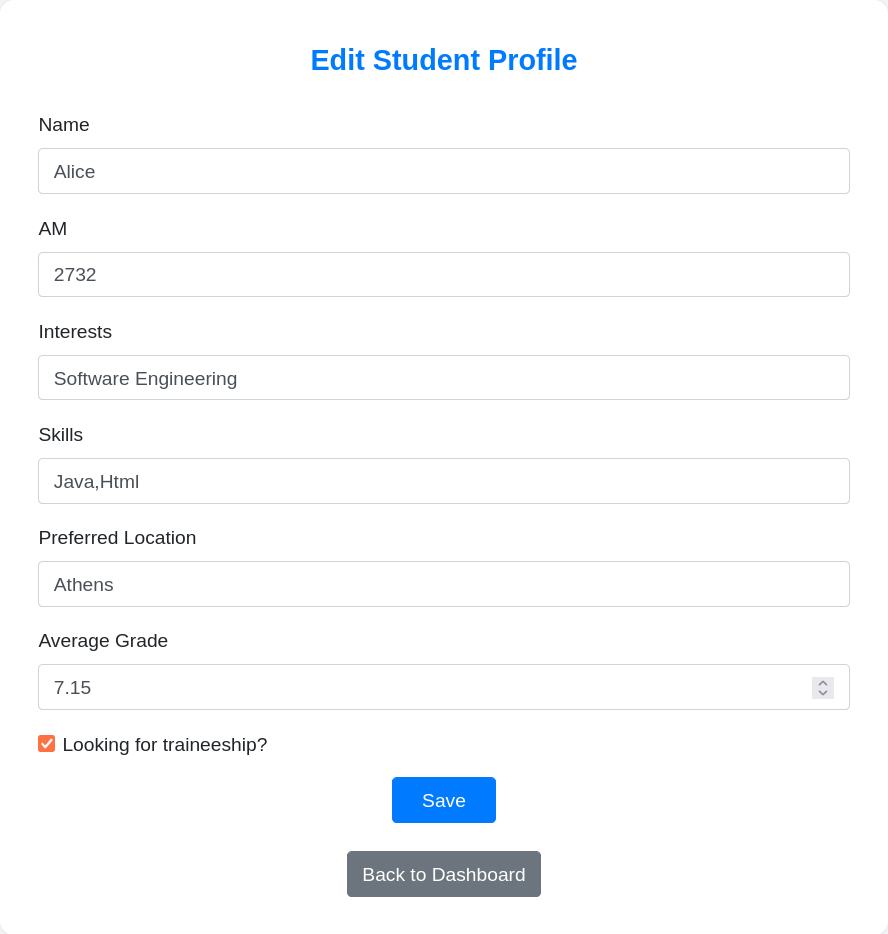
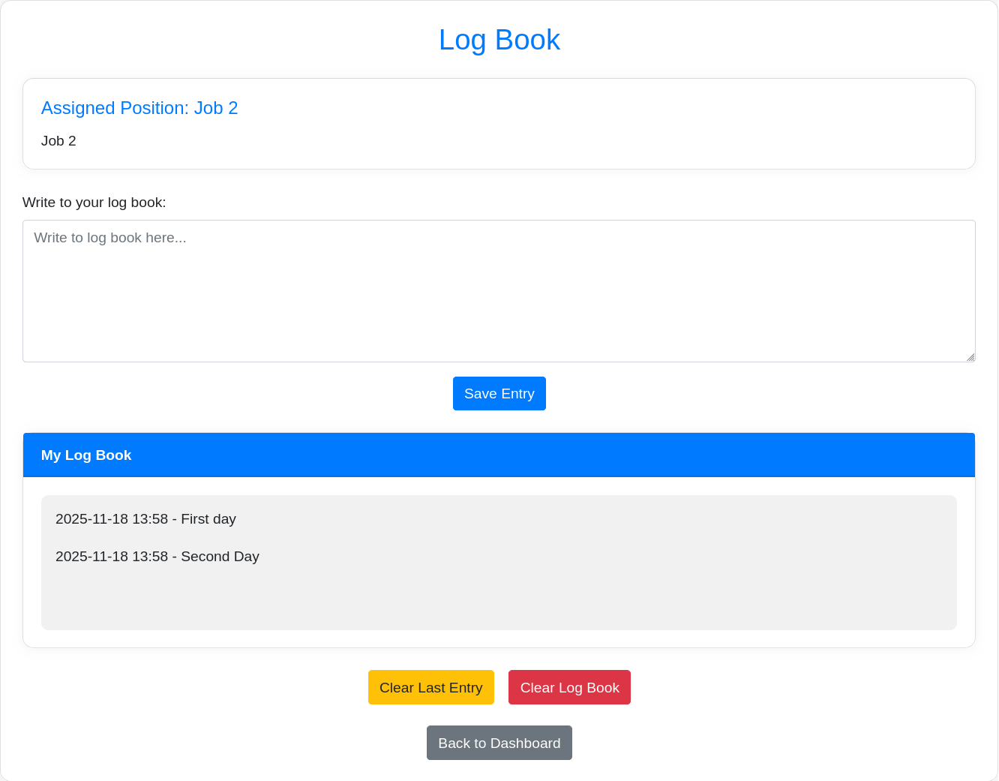
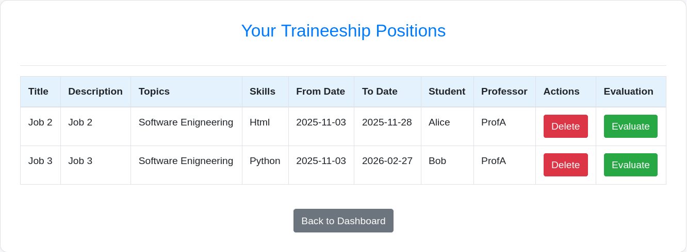
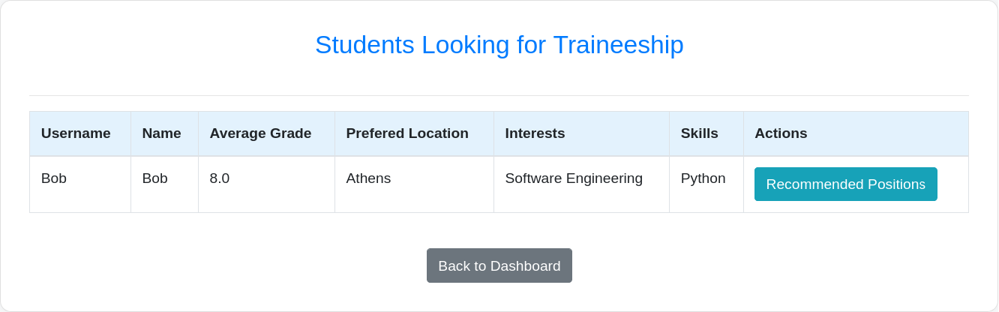
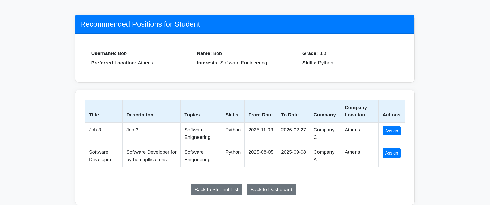
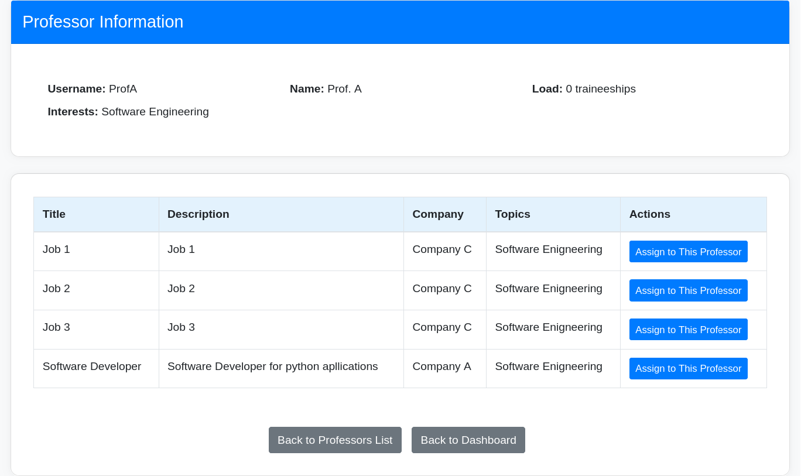
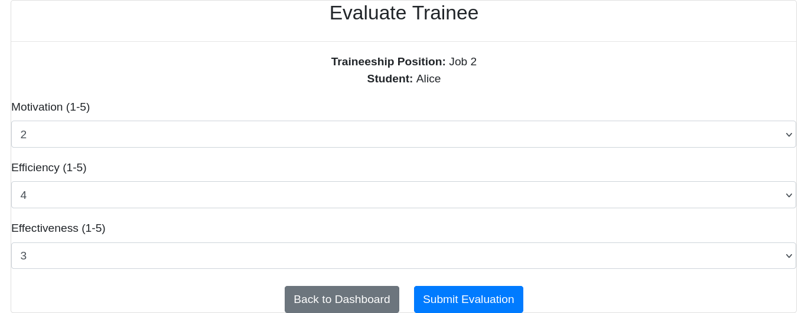
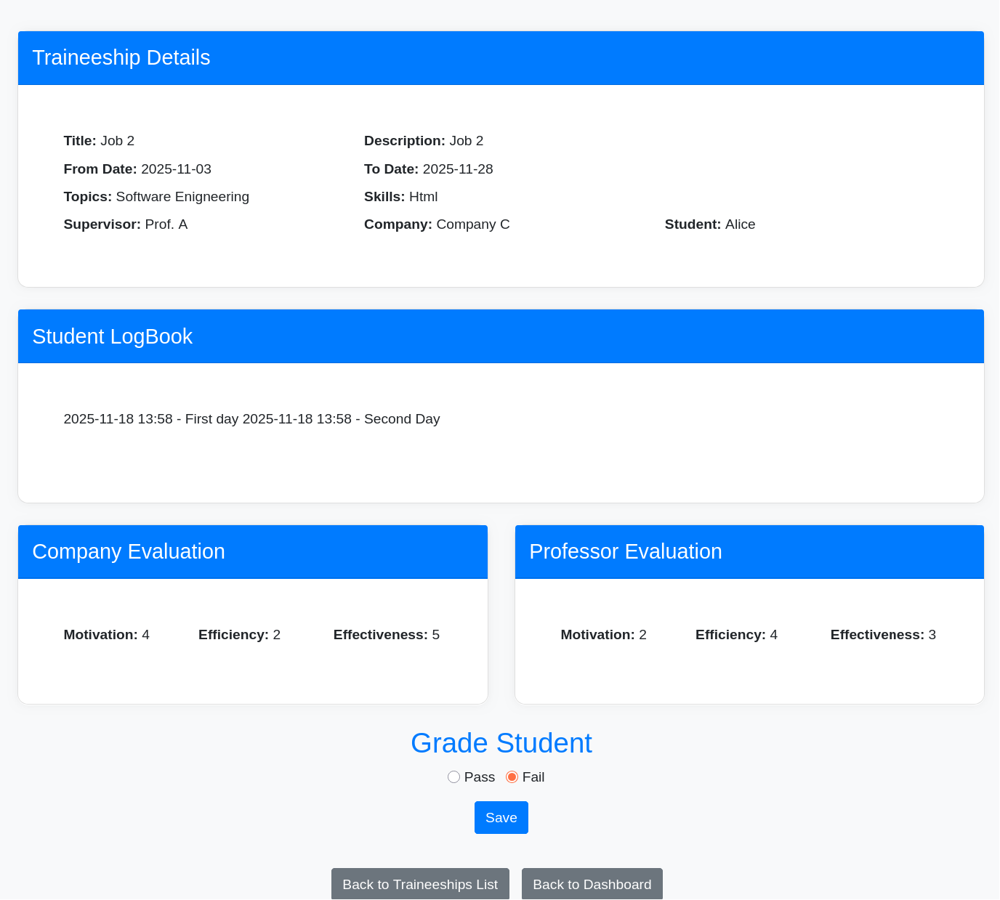

# traineeship-manager
A Springboot java web application, for managing traineeships using a MySQL database build for University course "MYY803 Software Engineering"
## Included
- source code for project
- Maven wrapper
- SQL file for initializing the database
- pom.xml
- project report given for certain course
- Unit tests
## Build Instructions
```bash
clone https://github.com/Miltos-Chalaidopoulos/traineeship-manager
cd traineeship-manager
mv mvn .mvn
./mvnw spring-boot:run # for linux/MacOS
mvnw.cmd spring-boot:run # for Windows
```
Additionally you will need to create a MySQL Databese with name `myy803` and execute the `myy803.sql` .
You can go from project file to `/src/main/resources/application.properties` and edit the SQL connection username and password.
Apllication shlould hear in localhost,port8080 ( http://localhost:8080/ )

## Application
Some screenshots from the Traineeship maanger
### Main Menu

### Students dashboard

### Edit Students profile

### Traineeship student log book

### Company's ongoing Traineeships

### Traineeship's committee Student assigment

### Traineeship's committee Student assigment

### Traineeship's committee Professor assigment

### Student evaluation from Company/Professor

### Student Evaluation from Traineeship committee

